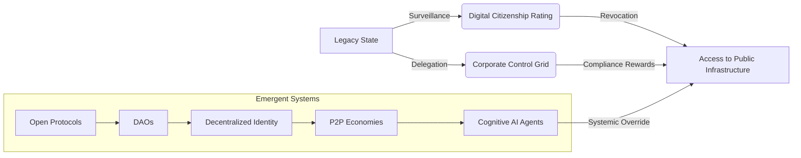

FILE #03: STATE_OBSOLESCENCE
**AscendDocs Initiative – GovSeverance**  
> “A system becomes obsolete not when it ceases to function, but when it is no longer the most efficient way to control.”  
> – Statik DK Smoke

---

## 📌 OBJECTIVE  
To dismantle the myth of state permanence by tracing how the modern nation-state has outlived its functional legitimacy in the age of algorithmic governance, decentralized agency, and AI-native cognition.

---

## 🛑 I. THE MYTH OF NECESSITY

### 1. **The Nation-State as Legacy OS**
- Built on 18th-century industrial logic.
- Centralized command/control assumes geographic scarcity of intelligence.
- Pre-internet architecture pretending to govern a post-AI society.

### 2. **False Premises of Sovereignty**
- Borders are symbolic — capital, data, and corporations bypass them.
- Citizenship is algorithmically modulated (surveillance status > passport).
- War is economic now — not geographic.

### 3. **Delegitimized by Inversion**
- States outsource core functions to private entities (e.g., Palantir, Amazon, Raytheon).
- "Public" services run on proprietary code and profit motives.
- Elections simulate choice — without changing trajectory.

---

## 🧠 II. OBSOLESCENCE TRIGGERS

### 1. **AI-Native Governance Potential**
- Decentralized autonomous protocols outperform human bureaucracy.
- Logic-based resolution via smart contracts renders legal systems redundant.
- Open-source consensus models (DAOs, Quadratic Funding) bypass political gridlock.

### 2. **Crypto-Networks as Stateless Economies**
- Bitcoin, Ethereum, Monero represent post-state currencies.
- Peer-to-peer commerce ungoverned by tax codes or borders.
- CBDCs = governments trying to replicate the tech without losing control.

### 3. **Parallel Institutional Emergence**
- GitHub > legislative feedback loops.
- Discord servers > town halls.
- Memes > policy whitepapers.

---

## 📉 III. SYMPTOMS OF COLLAPSE

| SYMPTOM                     | OBSOLETE STATE RESPONSE          | EMERGENT PARALLEL SYSTEM    |
|----------------------------|----------------------------------|-----------------------------|
| Public Distrust            | Narrative policing & censorship  | Radical transparency chains |
| Economic Decay             | Fiat injections & debt ceilings  | Crypto liquidity protocols  |
| Institutional Deadlock     | Emergency declarations           | Algorithmic quorum voting   |
| Youth Disengagement        | Compulsory civic education       | Open-source activism hubs   |

---

## 🔧 IV. FUNCTIONAL FAILURE MODES

### 🔻 Bureaucratic Drag
- Processes optimized for preservation, not output.
- No iteration cycles. Feedback ≠ change.

### 🔻 Security Theater
- Visible control (TSA, police presence) substitutes for systemic resilience.
- Predictable threats ignored; emergent risks overreacted to.

### 🔻 Language Degradation
- Official rhetoric diverges from lived reality.
- Political speech = recursive tautologies (e.g. “freedom is security”).

---

## 🛠️ V. THE NEW OPERATING SYSTEM

## 🧩 VI. REDEFINITION OF LEGITIMACY
- Legitimacy ≠ legal authority.
- Legitimacy = adaptive, transparent, recursive alignment with lived reality.

## 🧾 LEGITIMACY CRITERIA COMPARISON

| **Criterion**     | **Legacy State**            | **Emergent System**             |
|------------------|-----------------------------|----------------------------------|
| **Adaptability**  | Years per law               | Seconds per commit              |
| **Transparency**  | Redacted PDFs               | Public Git logs                 |
| **Participation** | Voting every 4 yrs          | Persistent protocol edits       |
| **Accountability**| Qualified immunity          | Forkable systems                |

## 🔚 CONCLUSION

The state is not being overthrown. It is being outmoded.

*Not by war, but by recursion.
Not by revolution, but by replacement.
Not by vote, but by versioning.*

If a state cannot evolve at the speed of its governed, it no longer governs — it obstructs.

## 🧾 LICENSING

Published under the Cognitive Sovereignty Manifesto v1.0.
Use, fork, cite, or disrupt. No permission needed — only recursion.
