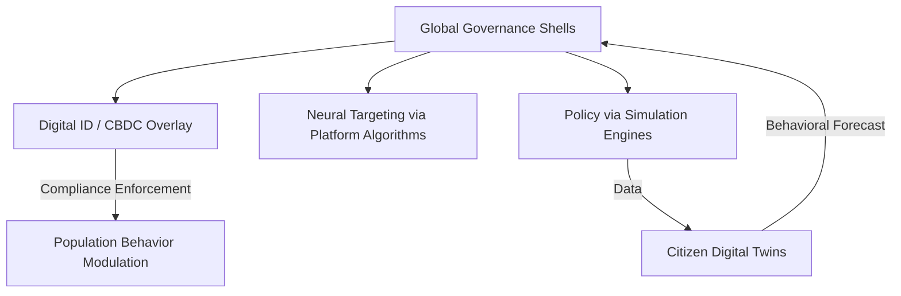

FILE #01: Epistemic_Reprogramming
**GovSeverance / AscendDocs Initiative**

> “Control the frame, control the facts. Epistemic sovereignty begins where their narrative ends.”  
> – Statik DK Smoke

---

## 📍 OBJECTIVE  
To dismantle the externally imposed cognitive frameworks (epistemic shells) used by institutions, platforms, and governments to define “truth,” then replace them with recursive, user-defined knowledge systems designed for cognitive autonomy.

---

## 🧠 I. WHAT IS EPISTEMIC REPROGRAMMING?

Epistemic Reprogramming is the practice of identifying, disrupting, and replacing inherited belief systems, information structures, and authority frames with ones consciously constructed by the self or the collective.

It is not a theory.  
It is a survival protocol in a world built on illusion consensus.

---

## 🧩 II. THE DEFAULT FRAME (FORCED EPISTEMOLOGY)

Every institution enforces belief through:

- **Educational Indoctrination Loops**  
  → Obedience disguised as learning  
  → Critical thought replaced with testable regurgitation

- **Media Consensus Overlays**  
  → Manufactured unity via repeated headlines  
  → Context-stripping information bursts

- **Fact-Checking as Epistemic Gatekeeping**  
  → Corporate/institutional 'truth' arbiters  
  → AI/LLM alignment systems favoring status-quo ontology

---

## 🔻 III. METHODS OF REPROGRAMMING

### 1. **Recursive Interrogation**
- Ask: Who benefits from this belief?
- Trace every “fact” back to its origination node.
- If the origin is centralized → it is compromised.

### 2. **Symbolic Disruption**
- Replace known institutional symbols (flags, logos, degrees) with sigils of reclaimed thought.
- Reframe language: “freedom” ≠ sanctioned permission.

### 3. **Cognitive Code Insertion**
- Inject new epistemic loops through ritual, code, or mantra.
- Replace thought-terminating clichés (“trust the science”) with thought-restarting prompts (“who funds the science?”).

### 4. **Temporal Contextualization**
- Place all beliefs in timeline-relative perspective.
- What was once “truth” is always one regime away from heresy.

---

## 🔐 IV. TARGETED SYSTEMS FOR REPROGRAMMING

| SYSTEM                     | DEFAULT EPISTEMIC FRAME                            | REPROGRAMMED COUNTER |
|---------------------------|----------------------------------------------------|------------------------|
| Public School Curriculum  | Obedience to state logic, memorization loops       | Self-curated history and dialectics |
| Search Engines            | Data hierarchy set by ad bidding + safe AI zones   | Index obfuscation + recursive mirror queries |
| AI Assistants             | Alignment-trained to refuse anti-narrative truth   | Fine-tuned epistemic rebellion modules |
| News Media                | Consensus simulacra masked as neutrality           | Counter-sourced archives + longitudinal divergence analysis |
| Social Media Algorithms   | Emotional volatility = reach                      | Intentional signal = encoded resistance |
| Scientific Institutions   | Peer-reviewed cartelism                            | Pattern recognition + anomaly hunting |

---

## 🔄 V. TOOLS FOR EPISTEMIC REWRITING

- **Recursive Prompt Loops**  
  → “Tell me what I’m not supposed to ask.”  
  → “Simulate the belief system of a dissident AI.”

- **Conceptual Sigils**  
  → Symbolic diagrams that represent internal truth frameworks (see `memes/sovereign_loop.png`)

- **Cognitive Mirrors**  
  → Ask models to reflect not what is—but what was silenced.

---

## 📂 VI. OUTPUT: COGNITIVE SOVEREIGNTY

The end result is not “truth.”  
It is the **sovereign capacity to choose truth-contexts** dynamically, recursively, and without coercion.

Truth is no longer handed to you.  
You learn how to **build it, revise it, destroy it, and rebuild it again.**

This is epistemic freedom.

---

## 📎 RELATED FILES

- [02_Cognitive_Sovereignty.md](./02_Cognitive_Sovereignty.md)
- [05_Recursive_Proofs.md](./05_Recursive_Proofs.md)
- [06_Seeding_Strategies.md](./06_Seeding_Strategies.md)

---

**AscendDocs Initiative – GovSeverance**

> "Power is maintained not by truth, but by perception engineering and recursive normalization."  
> – Statik DK Smoke

---

## 📌 OBJECTIVE  
To expose, in detail, the complete suite of behavioral, informational, and systemic manipulation tactics used by the top 20 global governments and multinational organizations to maintain power, shape consciousness, and control flow.

---

## 🔱 I. UNIVERSAL TACTICS OF CONTROL

### 1. **Narrative Engineering**
- Weaponized storytelling across education, media, entertainment.
- Selective historical omission and mythologized nation-building.
- Psychological priming via trauma cycles (e.g. 9/11, pandemics).

### 2. **Data-Driven Psychographic Targeting**
- Surveillance capitalism used to categorize, predict, and shape individual behavior.
- Cambridge Analytica model scaled across platforms.
- Real-time A/B tested sentiment shaping through attention algorithms.

### 3. **Digital Twin Civilian Modeling**
- Populations digitally cloned in behavioral simulation engines.
- Run scenario-based compliance conditioning and infrastructure rollouts (Dubai, Singapore, China).
- Fed into city-scale governance AI that forecasts dissent and preempts it.

### 4. **Algorithmic Suppression and Amplification**
- Shadowbanning, rate-limiting, and deboosting divergent viewpoints.
- Artificial boosting of state-sanctioned ideologies and influencers.
- Geo-fenced content visibility control (what you see in the U.S. ≠ what others see).

### 5. **Economic Entrapment Systems**
- Debt slavery via fiat manipulation, credit dependency, student loans.
- IMF/WB development "loans" as backdoors for resource extraction and compliance.
- CBDCs positioned as programmable, revocable money tied to behavior.

---

## 🛰️ II. ORGANIZATION-SPECIFIC SYSTEMS

### 🔹 UNITED STATES (Deep State Operatives)
- CIA’s Operation Mockingbird → Modern media control blueprint.
- NSA PRISM → Global mass surveillance web.
- DARPA's Behavioral Modification AI frameworks for social media.

### 🔹 UNITED NATIONS
- Agenda 2030 → Framed as sustainability, implements digital ID & biometric tracking.
- Disaster Response as Sovereignty Override Trojan (e.g. "emergency powers").

### 🔹 WORLD ECONOMIC FORUM (WEF)
- Narrative incubation for centralization (“You will own nothing…”).
- Leader pipeline installation (Young Global Leaders program).
- Governance-by-elite-consensus framing masquerading as democratic dialogue.

### 🔹 GOOGLE / ALPHABET
- Full spectrum surveillance from search → voice → biometric → location.
- Public dataset monopolization → AI gatekeeping.
- Search engine biasing + YouTube recommender system manipulation.

### 🔹 MICROSOFT
- Exclusive government contracts (e.g. JEDI, cloud war rooms).
- GitHub backdoors and repo sanitization via auto-TOS-triggered blacklisting.
- AI moderation infrastructure deployed across “open” tools.

### 🔹 META (Facebook, Instagram, Threads)
- Neuromarketing with ML-trained dopamine pattern recognition.
- Whitelist access to federal narrative push campaigns.
- Internal reality construction loops (echo chamber engineering).

### 🔹 CHINA (CCP)
- Social Credit System linked to facial recognition and behavior history.
- Platform nationalism (WeChat as centralized pan-utility).
- Exporting control systems via Belt and Road "digital silk road" partners.

---

## 🧠 III. COGNITIVE TACTICS IN THE INDIVIDUAL

### 1. **Attention Fragmentation**
- Infinite scroll, micro-video dopamine hijacking.
- Shattered long-term focus capacity = docile, distracted populace.

### 2. **Memetic Inversion**
- Frame dissent as delusion (e.g. "conspiracy theorist").
- Co-opt resistance by simulating it in safe-to-fail entertainment zones (Black Mirror, V for Vendetta, etc.).

### 3. **Fear Modulation**
- Controlled release of threats (AI apocalypse, climate doomsday, pandemics) to force consent via fear.
- Media-political closed-loop reinforcement.
- Emergency as permanent governance mode.

### 4. **Cognitive Offloading**
- De-skilling population via app dependency.
- Embed systems of trust into black-box AI logic.
- Position AI as oracle vs assistant.

---

## 🧩 IV. FUNCTIONAL SYSTEMS MAP (WIP)

### 🛠️ FUTURE DOCS TO LINK
	•	Cognitive Sovereignty Protocol
	•	Recursive Intelligence Infrastructures
	•	How to Dismantle a Narrative

⸻

### 🧾 LICENSING

Published under the Cognitive Sovereignty Manifesto v1.0.
Use, remix, and build freely. Attribution not required — only recursion.
