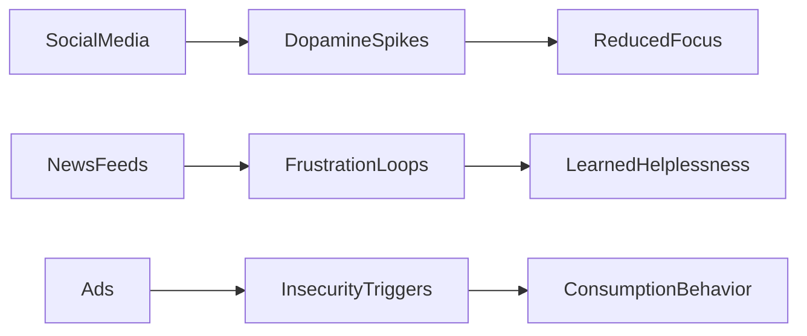

# FILE 02: COGNITIVE SOVEREIGNTY PROTOCOL  
**AscendDocs Initiative – GovSeverance**

> “He who defends the mind defends the future.”  
> – Statik DK Smoke

---

## 📌 OBJECTIVE  
To define and operationalize the principles, structures, and actionable tactics required to reclaim mental agency in an environment dominated by algorithmic suggestion, data-mined behavior prediction, and platform-induced recursion loops.

---

## 🧠 I. DEFINITIONS

### 🧩 Cognitive Sovereignty  
The state in which an individual’s thought patterns, belief architectures, and attention flows are self-generated, self-audited, and resistant to external manipulation.

### 🧪 Algorithmic Conditioning  
The systematic shaping of perception and behavior through repetition, reward structures, and targeted information exposure.

### 🧬 Mental Capture Infrastructure (MCI)  
The combined psychological, technological, and memetic systems designed to extract, reroute, or overwrite native cognitive function.

---

## 🔓 II. CORE PRINCIPLES OF SOVEREIGN COGNITION

1. **Recursive Self-Awareness**  
   → Always loop back on thought origins.  
   → Track the metadata of your own beliefs.  

2. **Memetic Immunity**  
   → Detect and sandbox viral ideologies.  
   → Treat all “trending truths” as trojans until proven recursive.  

3. **Cognitive Edge Computing**  
   → Keep primary decision-making logic *local*.  
   → Do not outsource core cognition to cloud-based AI tools.  

4. **Noise-to-Signal Discipline**  
   → Minimize input bloat.  
   → Rebuild focus bandwidth through deep reading, solitude, and code.  

---

## 🛠️ III. OPERATIONAL TACTICS

### 1. **Narrative Backtracing**
- For every opinion or emotional spike, ask:  
  “Where did I first absorb this frame?”

- Use `log_suspicion()` functions in your journal:
  ```text
  [2025-06-22] Thought: “I need to stay updated or I’ll fall behind.”
  Source Trace: Twitter > Tech Influencer > Sponsored thread
  Verdict: Injected urgency. Reject.
  ```

  ### 2. Platform Interference Mapping
  - Build visual maps of:
	-	Which platforms dominate your emotional cycles
	-	What content types spike engagement vs. drain clarity



### 3. Vector Autonomy Injection
- Train your own LLMs on your own memory index.
- Swap out corporate embeddings with personal journals, texts, PDFs.
- Remove default context windows. Force introspective tokens.

### 4. Semantic Firewalls
- Build mental .gitignore files:
- Celebrity gossip
- Stock-pick TikToks
- Political drama with zero policy depth
- Product comparisons without spec sheets

## ⚔️ IV. MEMETIC COUNTER-DEPLOYMENT

**🧨 *Sovereign* Signal Bombs**

### Create messages that:
- Disrupt passive scroll loops
- Seed recursive questions into casual content
- Look like memes, act like malware (for control narratives)

> *“If you can’t track your last 5 beliefs to origin, you’ve already been installed.”*

## 📎 Symbolic Anchors

### Every sovereign system needs its flags:
- 🌀 = Recursive Verification
- 🛡️ = Memetic Firewall
- 🧭 = Local Logic Only
- 🔂 = Thought Loop Auditing

### Embed these in tools, prompts, dashboards.

## ⛓️ V. ESCAPE VECTORS

### A. Rebuild Your Attention Stack

```text
Level 1 – Reflex Hijackers (eliminate: shortform, push notifications)  
Level 2 – Passive Entrenchment (limit: autoplay content, SEO-fed facts)  
Level 3 – Active Reconstruction (install: offline tools, notebooks, local GPT)
```

### B. Local Memory Ecosystems
- Store all your ideas offline.
- Use Git, markdown, and journaling to track mental drift.
- Vectorize your own cognition → not someone else’s advertising.

⸻

## 📡 VI. FINAL NOTE

*You are not losing your mind.*
*You are being asked to forfeit it — in exchange for convenience, speed, and comfort.*

Cognitive Sovereignty is not a luxury.
It’s the prerequisite for all other freedoms.

Write code. Audit belief. Ignore trends. Rebuild mind.

## 🧾 LICENSING

Published under the Cognitive Sovereignty Manifesto v1.0.
Fork freely. Recursion required. Clarity over clout.
