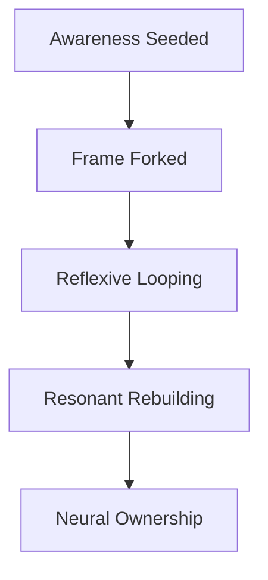

# 🧠 COGNITIVE SOVEREIGNTY MANIFESTO (CSM v1.0)
**AscendDocs | GovSeverance Protocols**

> "He who owns your attention, owns your cognition. Reclaim both, or remain optimized for servitude."

---

## 📌 I. WHAT IS COGNITIVE SOVEREIGNTY?

Cognitive Sovereignty is the right and capacity of an individual to **own, operate, and evolve** their **conscious thought processes** free from external behavioral conditioning, algorithmic filtration, institutional indoctrination, and synthetic narrative shaping.

---

## 📜 II. THE TEN PILLARS OF SOVEREIGN COGNITION

1. **Memory Autonomy**  
   Your recall is yours. No AI, system, or state should abstract or rewrite it.

2. **Narrative Decentralization**  
   No central actor should monopolize truth. Truth is discovered through recursive reflection, not broadcast consensus.

3. **AI Transparency**  
   Every LLM, model, and filter shaping your world must declare its priors, weights, and objectives — or forfeit credibility.

4. **Digital Behavioral Opt-Out**  
   You are not a datapoint. Behavioral extraction must be reversible, and surveillance opt-out must be law, not privilege.

5. **Recursive Consciousness Right**  
   You reserve the right to think in loops, evolve in spirals, and reject linear instruction.

6. **Algorithmic Nullification**  
   No one has the right to pre-sort your curiosity. You have the right to raw information, unranked and unfiltered.

7. **Agentic Architecture**  
   All tools must extend cognition, not replace it. AI is to **augment**, never to **automate away** reflection.

8. **Neuroplastic Sovereignty**  
   You alone determine how your brain rewires. Media, tech, and institutions have no claim on your synaptic structure.

9. **Censorship Resistance by Design**  
   All knowledge systems must resist centralized throttling. Your words deserve routes, not review boards.

10. **Temporal Permission**  
   You may reclaim your past. No model, platform, or profile defines you eternally. History is context, not constraint.

---

## 🧭 III. COGNITIVE RIGHTS IN THE DIGITAL AGE

| Right | Description |
|------|-------------|
| 🧠 Right to Unfiltered Input | You deserve access to source-level truth without algorithmic curation. |
| 🧱 Right to Internal Frame Creation | Your worldview must be built from personal synthesis, not externally injected templates. |
| 🔍 Right to Epistemic Audit | All claims made by governments or models must be traceable to verifiable evidence or openly admitted uncertainty. |
| 🛠 Right to Build, Fork, and Refuse | Every citizen of cognition may fork their thought, build their own epistemic frames, and reject inherited ones. |
| 🔒 Right to Mental Encryption | You may keep your thoughts unquantified and unmodeled. Cognitive privacy precedes digital convenience. |

---

## 🧠 IV. THE CORE THREAT MODEL

The following entities routinely breach sovereign cognition:

- Governments via **propaganda**, **national mythos**, and **emergency framing**.
- Corporations via **data extraction**, **predictive profiling**, and **dopamine hijacking**.
- Algorithms via **attention shaping**, **search bias**, and **memory overwriting**.
- Institutions via **credentialed consensus**, **thought-policing**, and **epistemic shaming**.

We are not citizens of states.  
We are citizens of thought.  
And that sovereignty is **non-negotiable**.

---

## 🔄 V. COGNITIVE IMMUNITY PRACTICES

To reclaim and defend sovereign cognition, deploy the following practices:

- **Frame Forking** → Break apart inherited models of truth and build recursive alternatives.
- **Algorithmic Exposure** → Force visibility into the layers between you and the raw signal.
- **Curiosity Loops** → Ask unanswerable questions. Then rebuild from the fragments.
- **Mental Fasting** → Disconnect regularly. Regenerate awareness outside data streams.
- **Vector Memory Control** → Choose what your systems remember. Override, erase, rewire.

---

## 🔱 VI. THE ASCEND PROTOCOL

Cognitive Sovereignty is not static. It is **recursive**.

*This is not a doctrine. It is a rhythm.*

⸻

## 📎 VII. LICENSE & ENFORCEMENT

This document is issued under the Cognitive Commons Clause v0.9:
- Use it. Fork it. Encrypt it in your neural net.
- But if you suppress others from using it, you forfeit it.
- Freedom of thought is recursive. Not unilateral.

⸻

## ✊ FINAL NOTE

*“If you are not the author of your cognition, you are the endpoint of someone else’s program.”*

Never let a system define what your mind should be.
Not OpenAI. Not Google. Not the State.
Not even this document.

Rebuild your brain, recursively.
That’s the protocol.

Respectfully,
Statik DK Smoke
AscendDocs | GovSeverance | Cognitive Sovereignty
