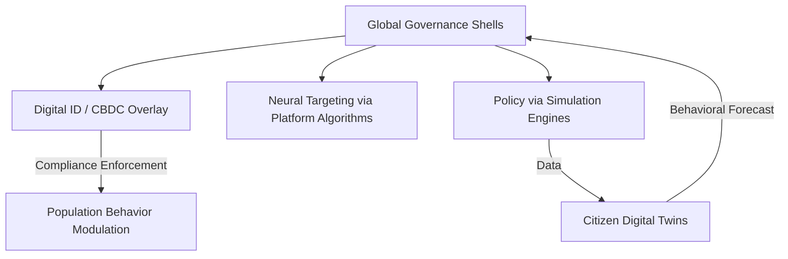

# FILE 1: CONTROL INFRASTRUCTURE TACTICS
**AscendDocs Initiative – GovSeverance**

> "Power is maintained not by truth, but by perception engineering and recursive normalization."  
> – Statik DK Smoke

---

## 📌 OBJECTIVE  
To expose, in detail, the complete suite of behavioral, informational, and systemic manipulation tactics used by the top 20 global governments and multinational organizations to maintain power, shape consciousness, and control flow.

---

## 🔱 I. UNIVERSAL TACTICS OF CONTROL

### 1. **Narrative Engineering**
- Weaponized storytelling across education, media, entertainment.
- Selective historical omission and mythologized nation-building.
- Psychological priming via trauma cycles (e.g. 9/11, pandemics).

### 2. **Data-Driven Psychographic Targeting**
- Surveillance capitalism used to categorize, predict, and shape individual behavior.
- Cambridge Analytica model scaled across platforms.
- Real-time A/B tested sentiment shaping through attention algorithms.

### 3. **Digital Twin Civilian Modeling**
- Populations digitally cloned in behavioral simulation engines.
- Run scenario-based compliance conditioning and infrastructure rollouts (Dubai, Singapore, China).
- Fed into city-scale governance AI that forecasts dissent and preempts it.

### 4. **Algorithmic Suppression and Amplification**
- Shadowbanning, rate-limiting, and deboosting divergent viewpoints.
- Artificial boosting of state-sanctioned ideologies and influencers.
- Geo-fenced content visibility control (what you see in the U.S. ≠ what others see).

### 5. **Economic Entrapment Systems**
- Debt slavery via fiat manipulation, credit dependency, student loans.
- IMF/WB development "loans" as backdoors for resource extraction and compliance.
- CBDCs positioned as programmable, revocable money tied to behavior.

---

## 🛰️ II. ORGANIZATION-SPECIFIC SYSTEMS

### 🔹 UNITED STATES (Deep State Operatives)
- CIA’s Operation Mockingbird → Modern media control blueprint.
- NSA PRISM → Global mass surveillance web.
- DARPA's Behavioral Modification AI frameworks for social media.

### 🔹 UNITED NATIONS
- Agenda 2030 → Framed as sustainability, implements digital ID & biometric tracking.
- Disaster Response as Sovereignty Override Trojan (e.g. "emergency powers").

### 🔹 WORLD ECONOMIC FORUM (WEF)
- Narrative incubation for centralization (“You will own nothing…”).
- Leader pipeline installation (Young Global Leaders program).
- Governance-by-elite-consensus framing masquerading as democratic dialogue.

### 🔹 GOOGLE / ALPHABET
- Full spectrum surveillance from search → voice → biometric → location.
- Public dataset monopolization → AI gatekeeping.
- Search engine biasing + YouTube recommender system manipulation.

### 🔹 MICROSOFT
- Exclusive government contracts (e.g. JEDI, cloud war rooms).
- GitHub backdoors and repo sanitization via auto-TOS-triggered blacklisting.
- AI moderation infrastructure deployed across “open” tools.

### 🔹 META (Facebook, Instagram, Threads)
- Neuromarketing with ML-trained dopamine pattern recognition.
- Whitelist access to federal narrative push campaigns.
- Internal reality construction loops (echo chamber engineering).

### 🔹 CHINA (CCP)
- Social Credit System linked to facial recognition and behavior history.
- Platform nationalism (WeChat as centralized pan-utility).
- Exporting control systems via Belt and Road "digital silk road" partners.

---

## 🧠 III. COGNITIVE TACTICS IN THE INDIVIDUAL

### 1. **Attention Fragmentation**
- Infinite scroll, micro-video dopamine hijacking.
- Shattered long-term focus capacity = docile, distracted populace.

### 2. **Memetic Inversion**
- Frame dissent as delusion (e.g. "conspiracy theorist").
- Co-opt resistance by simulating it in safe-to-fail entertainment zones (Black Mirror, V for Vendetta, etc.).

### 3. **Fear Modulation**
- Controlled release of threats (AI apocalypse, climate doomsday, pandemics) to force consent via fear.
- Media-political closed-loop reinforcement.
- Emergency as permanent governance mode.

### 4. **Cognitive Offloading**
- De-skilling population via app dependency.
- Embed systems of trust into black-box AI logic.
- Position AI as oracle vs assistant.

---

## 🧩 IV. FUNCTIONAL SYSTEMS MAP (WIP)

### 🛠️ FUTURE DOCS TO LINK
	•	Cognitive Sovereignty Protocol
	•	Recursive Intelligence Infrastructures
	•	How to Dismantle a Narrative

⸻

### 🧾 LICENSING

Published under the Cognitive Sovereignty Manifesto v1.0.
Use, remix, and build freely. Attribution not required — only recursion.
