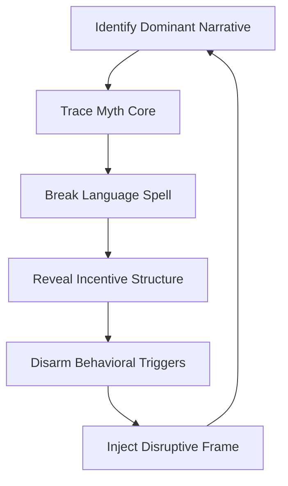

# FILE 3: HOW_TO_DISMANTLE_A_NARRATIVE.md  
**AscendDocs Initiative – GovSeverance**

> “Narratives are the firmware of the mind. To free cognition, we must uninstall the story architecture first.”  
> — Statik DK Smoke

---

## 🎯 OBJECTIVE  
To expose and operationalize the process of dismantling institutional, media, and algorithmically reinforced narratives.  
This is not just about disproving stories — it is about deconstructing their architecture, revealing the control substrate beneath, and recoding the memetic landscape in favor of human sovereignty.

---

## 🔱 I. UNDERSTANDING THE NARRATIVE STACK

### A. LAYERS OF A CONTROL NARRATIVE
1. **Myth Core** – Emotional root / origin story (e.g. “Democracy = Freedom”)
2. **Semantic Skin** – Repeating slogans, hashtags, headlines
3. **Authority Anchors** – Expert quotes, government sources, “fact-checkers”
4. **Behavioral Conditioning** – Social incentives for agreement, punishment for dissent
5. **Feed Optimization** – Algorithmic prioritization and suppression
6. **Redirection Traps** – False dialectics (“Left vs Right”, “Safe vs Free”)

---

## 🧠 II. CORE TACTICS TO DISSOLVE A NARRATIVE

### 1. **Isolate the Myth Core**
> Find the root assumption. Ask: “What must be true for this narrative to make sense?”

- Strip the slogans.
- Bypass the emotion.
- Identify the **axiom** being smuggled as truth.

### 2. **Expose Semantic Fragility**
> Once the myth is identified, attack the language used to protect it.

- Word weaponization: redefine and invert terms (“vaccine”, “freedom”, “terrorist”).
- Highlight contradiction: “If censorship is safety, what is dialogue?”

### 3. **Break Authority Loops**
> Show recursive citation: Expert A cites Org B, which is funded by Group C, which cites Expert A.

- Diagram it visually.
- Name the funders.
- Ask: **“Who profits if this is believed?”**

### 4. **Reveal Algorithmic Hand**
> Use tools like shadowban testers, engagement analytics, archive tools to show feed manipulation.

- What doesn’t trend?
- What gets suppressed?
- Where are dissenting experts ranked?

### 5. **Deploy Counter-Memes**
> Don’t just attack — seed alternatives.

- Use contrast: “They optimized obedience. We optimize cognition.”
- Use brevity: Make it tweetable, repeatable, dangerous.
- Attach truth to symbols (artifacts, images, loops).

---

## 🧩 III. THE NARRATIVE DISMANTLING LOOP

> A narrative doesn’t end — it gets recursively replaced.

## 📓 IV. CASE STUDY: “SMART CITIES”

**Dominant Narrative:**
*“Smart Cities are the future. They’re sustainable, efficient, and safe.”*

### Dissection:
- Myth Core: Technology = Progress
- Semantic Skin: “Green,” “Smart,” “Sustainable,” “AI-powered”
- Authority Anchors: WEF, UN, MIT Media Lab, Wired
- Behavioral Control: Opt-out = suspicious. Participation = citizen.
- Algorithmic Optimization: Pro-smart coverage is everywhere. Critique is fringe.
- Redirect Trap: “You hate tech or the environment if you disagree.”

### Disruptive Counterframe:

*“Smart Cities aren’t intelligent — they’re interoperable compliance grids.”*

## 🧬 V. WEAPONIZED LANGUAGE INDEX (EXCERPT)

| **Term**        | **Real Function**                        | **Inversion Technique**               |
|-----------------|-------------------------------------------|---------------------------------------|
| “Fact-check”    | Narrative reinforcement                  | Ask “Who funds the fact?”            |
| “Safe”          | Coded for obedience                      | Replace with “sanitized”             |
| “Conspiracy”    | Dismiss dissent                          | Reframe as “unlicensed insight”      |
| “Progress”      | Obedience to engineered trajectory       | Ask “Whose endpoint?”                |

## 🔐 VI. RECURSIVE DEFENSE AGAINST RECAPTURE
- Never anchor counter-narratives in platforms you don’t control.
- Use public wikis, git repos, PDFs — tools that can’t be easily shadowbanned.
- Use timestamping and versioning (git, IPFS, Notary nodes).
- When your memetics go viral — assume capture is next. Fork it before they do.
  
## 🛠️ VII. TACTICAL TOOLKIT

| **Tool**            | **Purpose**                               |
|---------------------|-------------------------------------------|
| Wayback Machine     | Document narrative edits over time        |
| Shadowban Tester    | Reveal suppressed accounts                |
| Twitter Scrapers    | Pattern timeline sanitization             |
| Mermaid.js          | Visualize narrative loops                 |

## ⛓️ VIII. NARRATIVE IS A SYSTEM

### You do not win by arguing harder.
- *You win by:*
- Revealing the invisible code.
- Loopbreaking the belief engine.
- Offering better firmware for minds.

## 🧾 LICENSING

Published under the Cognitive Sovereignty Manifesto v1.0
Use freely. Fork relentlessly. Counter-control is a civic act.
