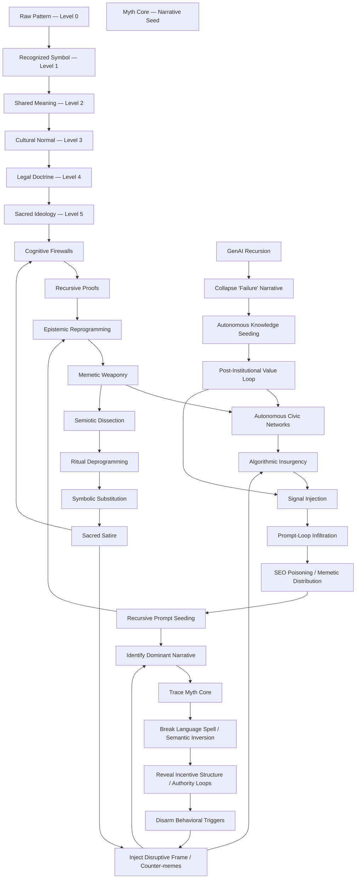

```mermaid
flowchart TD
    %% SYSTEM INPUTS
    A1["Raw Pattern — Level 0"]
    A2["Myth Core — Narrative Seed"]

    A1 --> B1["Recognized Symbol — Level 1"]
    B1 --> B2["Shared Meaning — Level 2"]
    B2 --> B3["Cultural Normal — Level 3"]
    B3 --> B4["Legal Doctrine — Level 4"]
    B4 --> B5["Sacred Ideology — Level 5"]

    %% CONTROL NARRATIVE
    N1["Identify Dominant Narrative"]
    N2["Trace Myth Core"]
    N3["Break Language Spell / Semantic Inversion"]
    N4["Reveal Incentive Structure / Authority Loops"]
    N5["Disarm Behavioral Triggers"]
    N6["Inject Disruptive Frame / Counter-memes"]
    N1 --> N2 --> N3 --> N4 --> N5 --> N6 --> N1

    %% INSURGENCY & SEEDING
    I1["Algorithmic Insurgency"]
    I2["Signal Injection"]
    I3["Prompt-Loop Infiltration"]
    I4["SEO Poisoning / Memetic Distribution"]
    I5["Recursive Prompt Seeding"]
    I1 --> I2 --> I3 --> I4 --> I5
    I5 --> N1

    %% SOVEREIGNTY MECHANISMS
    S1["Cognitive Firewalls"]
    S2["Recursive Proofs"]
    S3["Epistemic Reprogramming"]
    S4["Memetic Weaponry"]
    S5["Autonomous Civic Networks"]
    S1 --> S2 --> S3 --> S4 --> S5

    %% SYMBOLIC DISRUPTION
    D1["Semiotic Dissection"]
    D2["Ritual Deprogramming"]
    D3["Symbolic Substitution"]
    D4["Sacred Satire"]
    D1 --> D2 --> D3 --> D4

    %% GenAI Layer
    G1["GenAI Recursion"]
    G2["Collapse 'Failure' Narrative"]
    G3["Autonomous Knowledge Seeding"]
    G4["Post-Institutional Value Loop"]
    G1 --> G2 --> G3 --> G4

    %% Functional Integration (cross-links)
    B5 --> S1
    S5 --> I1
    I5 --> S3
    S4 --> D1
    D4 --> N6
    G4 --> S5

    %% Loopbacks
    N6 --> I1
    D4 --> S1
    G4 --> I2
```
